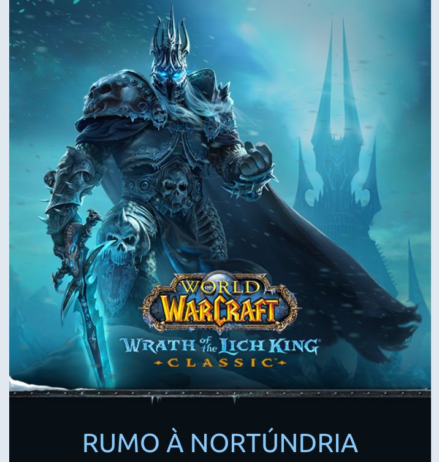
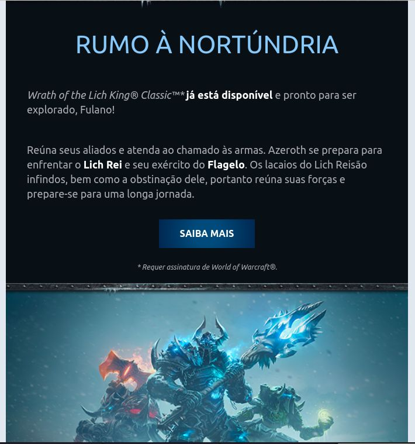
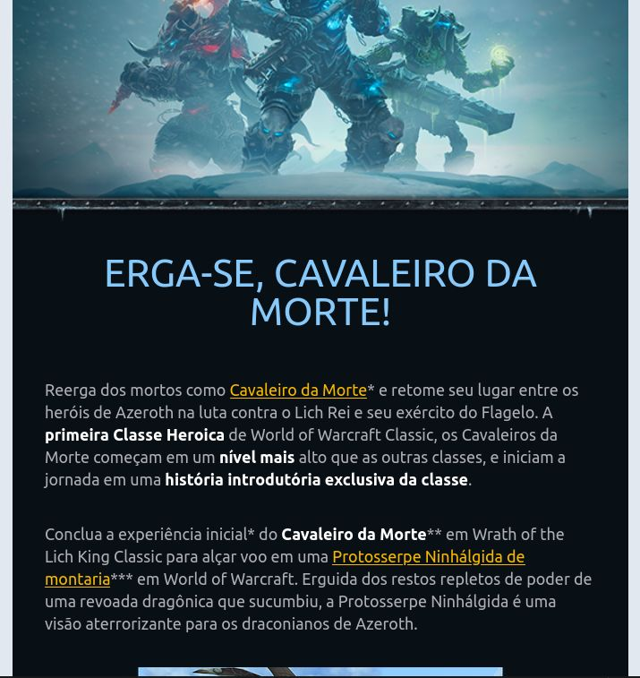
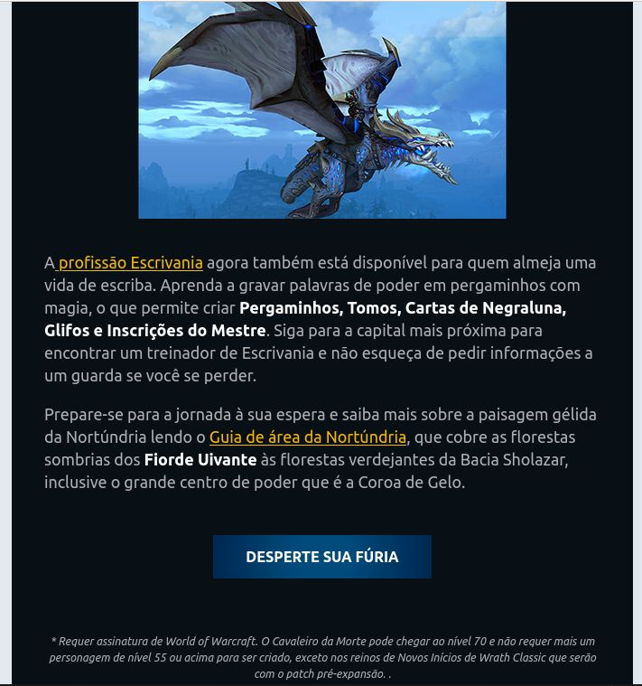
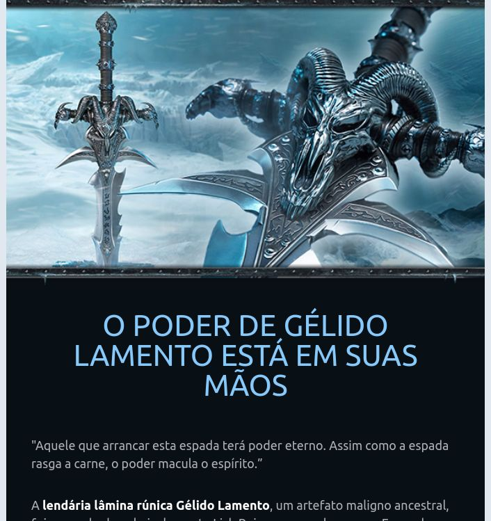
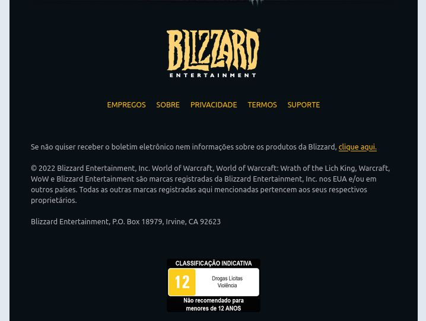

<h1 align="center"> E-mail WoW </h1>

 

## 🚀 Tecnologias

Esse projeto foi desenvolvido com as seguintes tecnologias:

- HTML e CSS
- JavaScript
- Tailwindcss

 

 
<h3 align="center">Tela de recriação </h3>

 
  

 

<h3 align="center">Tela de recriação - 2 </h3>

 
  

 

<h3 align="center">Tela de recriação - 3 </h3>

 
  

 

<h3 align="center">Tela de recriação - 4 </h3>

 
  

 

<h3 align="center">Tela de recriação - 5 </h3>

 
  

 

<h3 align="center">Tela de recriação - 6 </h3>

 
  

 

<h3 align="center">Tela de recriação - 7 </h3>

 
  

 

<h3 align="center">Tela de recriação - 8 </h3>

 
  

<h3 align="center">Tela de recriação - 9 </h3>

 
  

## 💻 Projeto

O projeto é uma cópia do e-mail de **Wrath of the Lich King Classic**, da empresa **Blizzard** e foi recriado para treinar as tecnologias utilizadas. O foco também foi a criação de componentes e organização dos mesmos.